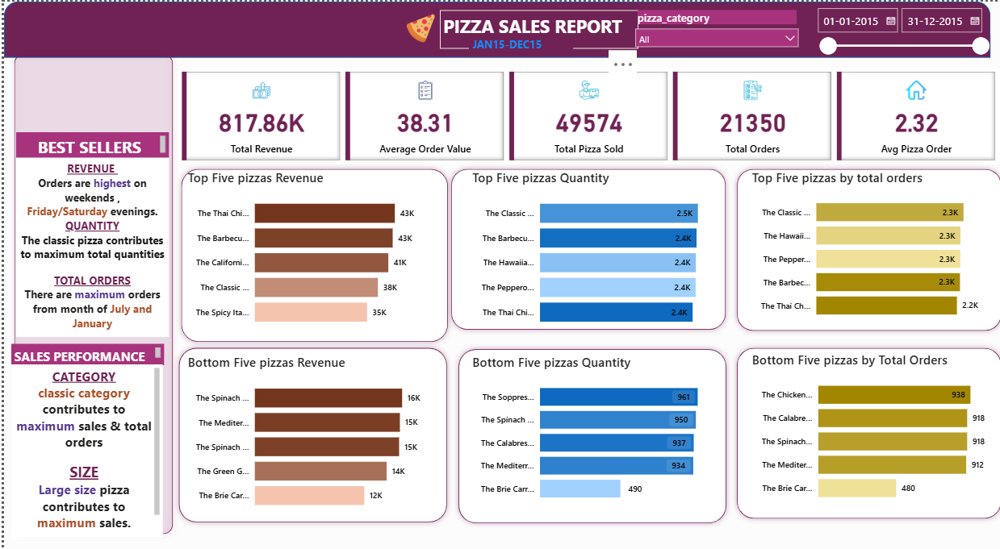

# 📊 Power BI Project - Business Insights Dashboard

##  Overview
This project is a **Power BI dashboard** built to analyze and visualize key business insights.  
It transforms raw data into meaningful, interactive visualizations that help decision-makers understand **performance, growth, and trends** effectively.

---

##  Objectives
- Provide an interactive dashboard for exploring business metrics.  
- Enable stakeholders to track **KPIs, trends, and patterns**.  
- Make data-driven decision-making easier through clear **visual storytelling**.  

---

##  Tools & Technologies
- **Power BI Desktop** (for data modeling & dashboard creation)  
- **DAX (Data Analysis Expressions)** for custom measures  
- **Power Query** for data cleaning & transformation  
---
## 📂 Project Structure
  ```bash
  📁 repository-name
 ┣ 📊 firstpowerbireport.pbix   # Main Power BI project file
 ┣ 📜 README.md                   # Documentation
  ```
## 📸 Dashboard Preview

  <p align="center">
    
  </p>

## 🔑 Key Features
- Interactive filtering by **categories & time periods**  
- Visual breakdown of **sales, customers, and growth trends**  
- **KPI cards** highlighting performance metrics  
- Charts & visuals for **comparative analysis**  

---

## 🚀 How to Use
1. Clone or download this repository.  
2. Open the file **`firstpowerbireportc.pbix`** in **Power BI Desktop**.  
3. Explore the dashboard by interacting with **filters and visuals**.  

---

## 📈 Insights & Learnings
- Learned how to build an **end-to-end Power BI dashboard**.  
- Gained experience in **data transformation & DAX calculations**.  
- Improved **storytelling skills through data visualization**.  

---
## 👨‍💻 Author

**Golla Bhargava Teja**  

- 🌐 [Projects](https://github.com/bhargavatejagolla)  
- 💼 [LinkedIn](https://www.linkedin.com/in/golla-bhargava-teja/)  
